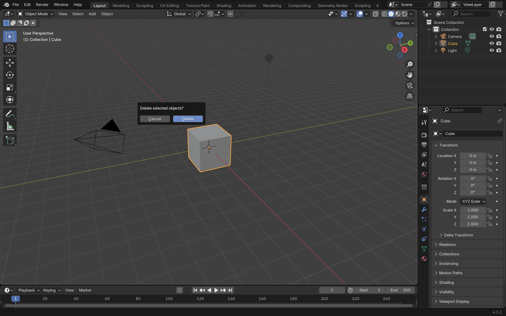
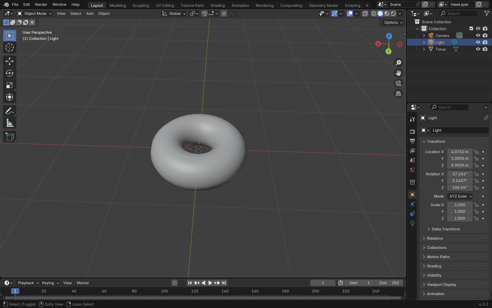
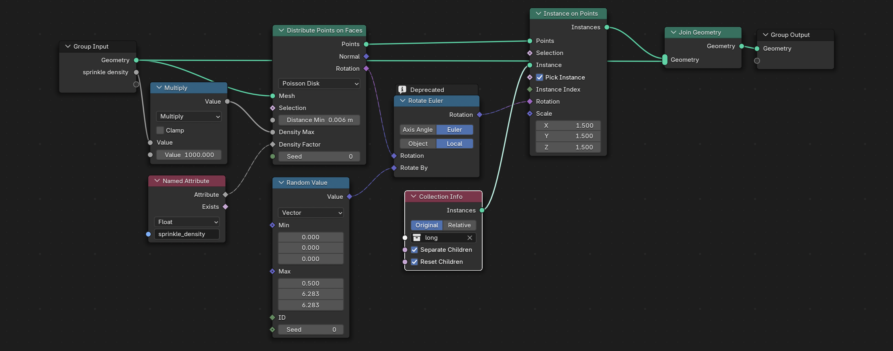
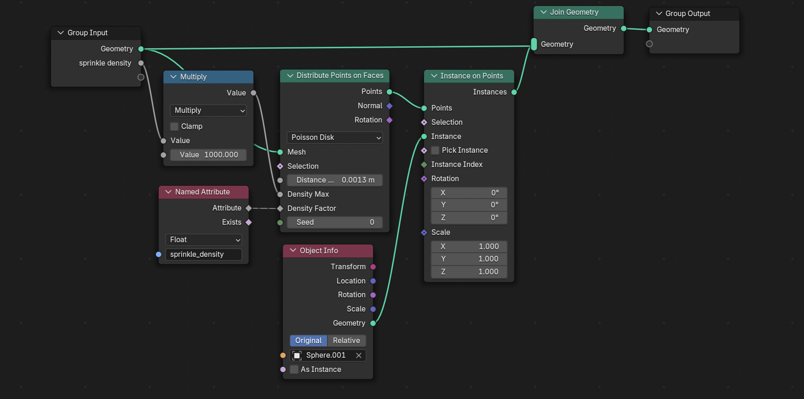
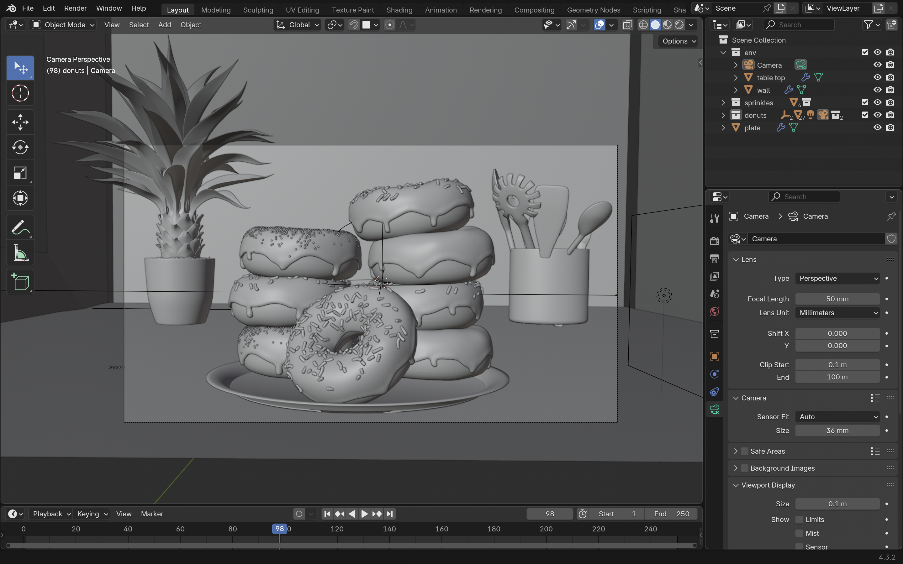
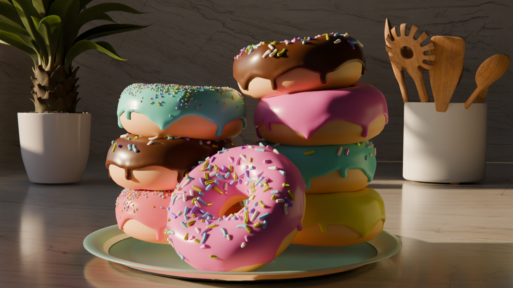

In April 2024, I came across a cool animation made in Blender and thought, 'Wow! That's crazy. I want to learn how to do that too'. So, I started my journey

At first, I was really confused because there were tons of buttons, shortcuts, tabs, and a cube in the middle.

**Pro tip:** Use [**Blender Shortcuts**](https://hollisbrown.github.io/blendershortcuts/) cheatsheet as it helped me remember the keys.

(Shortcut key: X to delete the default cube)

So, I did what everyone does when they're new and lost – I searched for “Blender tutorial for beginners” and came across the *iconic donut* tutorial by [**BlenderGuru**](https://www.youtube.com/@blenderguru/featured). If you want to learn Blender, start by making a donut 🍩. Most people begin their Blender journey here.

## What I Learned Throughout the Tutorial Series

### Part 1: Modeling the Donut Base

I started by doing what every Blender user does, that is to delete the default cube.Then I added a torus and began learning how to navigate in 3D space.

### Part 2: Adding Realistic Details

I started adding little bumps and imperfections to make my donut look like it came from a real bakery instead of a computer. I found this part really satisfying once I got used to the sculpting brushes.

### Part 3: Creating Icing 

This part blew my mind. I duplicated my donut, scaled it up slightly, and used Blender's modifier system to create icing that actually dripped down the sides using a sculpting brush grab. 

### Part 4: Making It Look Like Real Food

I learned to create realistic surfaces using the shader editor. The donut got texture and the icing became glossy.

### Part 5: Adding Sprinkles

I created different types of sprinkles - long and round ones. I used geometry nodes for this. The setup involved using "Distribute Points on Faces" to scatter points across the icing surface, then "Instance on Points" to place the sprinkle geometry. I controlled the sprinkle density with a named attribute and used Collection Info to randomly choose between different sprinkle shapes. The geometry nodes gave me precise control over placement, rotation, and scale variation etc.

Long Sprinkles:

Round Sprinkles:

### Part 6: Making the Background and Adding Textures

Once the donut was done, I added a simple plane for the tabletop and textured it with a marble material using a Principled BSDF shader for realism. Then, I modeled a plate for the donut and applied a shiny ceramic material with subtle imperfections.

I duplicated the donuts a few times and stacked them on the plate. The combination of textures and stacked donuts really brought everything together.

After this I set up the lighting to make the donut look good and positioned the camera and added depth of field to blur the background.

### Part 8: Creating My Final Render

The last step was generating the final image. I learned about render settings, balancing quality with render time, and made some basic color corrections to enhance the scene.

I used Cycles with GPU compute for faster rendering. After adjusting the settings, I rendered the scene and was finally able to see my donut in all its glory.

**Final Result!**

I had so much fun creating it, and I’m so happy with the final result. I never expected it would turn out this well. I’ll be spending this week getting back to learning more about Blender, and I’ll be sharing my progress soon.

 I hope you enjoyed this blog post :)

