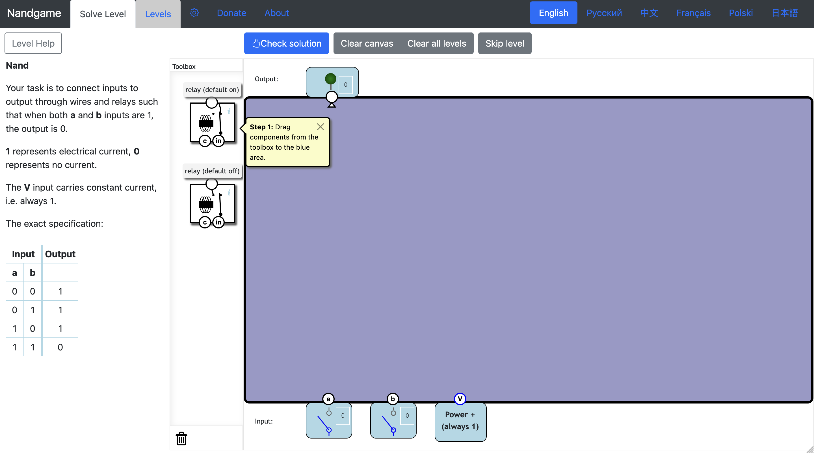

---
## Introduction

In March 2025, I signed up for the Coursera course <a href="https://www.coursera.org/learn/build-a-computer" target="_blank">From Nand to Tetris: Building a Modern Computer From First Principles</a> by Shimon Schocken and Noam Nisan. I thought, "Why not learn how computers work from the basics?" Spoiler: It’s not as easy as it sounds. The course promised to turn me into a computer-building wizard, and I got pretty far—completing four out of six projects. 

## Logic Gates from NAND

The course begins with an elegant premise: using only the elementary NAND gate, you can construct all other logic gates necessary for a modern computer. This concept blew my mind – the idea that complex systems ultimately reduce to this simple building block.

I started by implementing basic logic gates in the <a href = "https://nand2tetris.github.io/web-ide/chip/" target = "_blank">NAND2Tetris Hardware Simulator</a> using hdl:

- NOT gate
- AND gate
- OR gate
- XOR gate

**Pro Tip**: Use <a href = "https://www.nandgame.com/" target = "_blank">**NAND game**</a>! to understand how theses gates are formed using NAND. 

 

As It transforms theoretical concepts into visual patterns that make implementation much easier than it seems.

## From Gates to Chips
Once I had a handle on basic gates, it was time to get serious and build some chips. Enter the realm of multiplexers and demultiplexers. These allow you to:

- MUX (Multiplexer): Choose which input signal to use.
- DMUX (Demultiplexer): Route signals to different outputs based on selection bits.

I thought the difficulty would skyrocket when I started with the 16-bit and multi-way chips, but once I built the first 16-bit chip, the rest were a breeze—just a bit of grunt work, really.

**Arithmetic Components**

Next came the exciting part which is creating chips that can actually compute! I implemented:

- Half Adder (adding two bits)
- Full Adder (adding three bits with carry)
- Multi-bit Adder (for 16-bit )
- The ALU (Arithmetic Logic Unit) 

## From Bits to Storage

The next phase took me into the realm of computer memory, where I designed:
- Registers: Flip-flop based storage units that hold data temporarily
- RAM8: A small 8-register memory unit
- RAM64: A memory unit of 64-register
- RAM512, RAM4K, and RAM16K: Increasing memory units
- Program Counter (PC)

This hierarchy of memory components taught me how computers are organized. 

## Challenges and Limitations

While I successfully completed four projects, the two modules focused on assembly language programming were... let’s just say, less successful. I realized I’m a visual learner who prefers tools like simulators. Still, the struggle was part of the fun—sort of.

## Resources That Helped Me Succeed
- The  NAND game (seriously, don’t skip it!)
- Course forums where students swapped war stories about their challenges (misery loves company).
- Drawing chips designs on paper before implementatio

## Conclusion and Next Steps

While I didn't complete all six projects, the four I finished gave me a solid foundation in computer architecture that I'll build upon. 

If you're curious about how computers really work from the ground up, I highly recommend this course. It’s tough, but incredibly rewarding. After all, who wouldn’t want to say, “I built a computer from scratch with just a NAND gate”?

