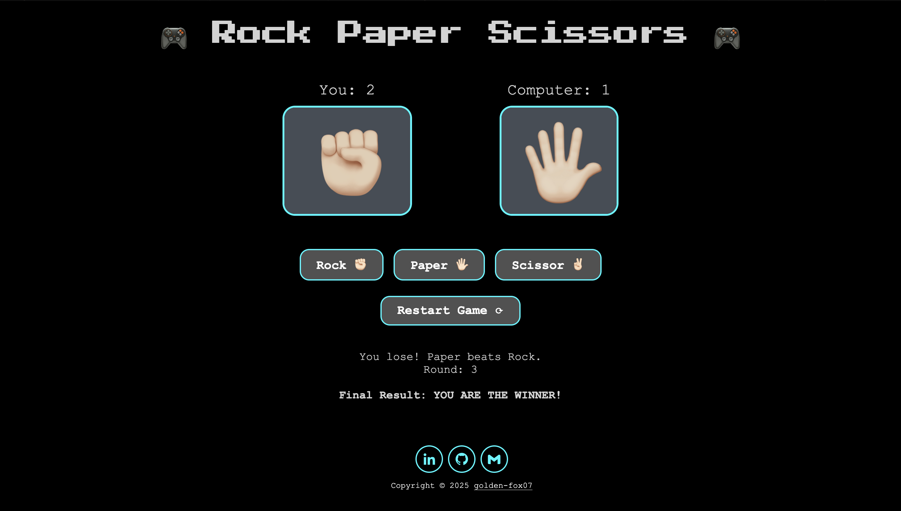
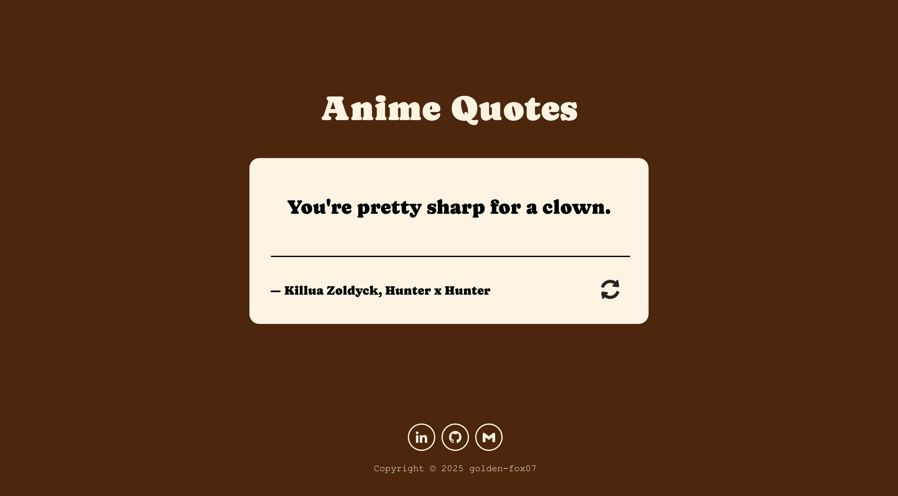
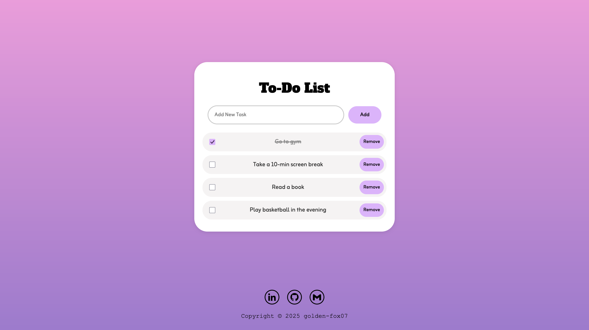
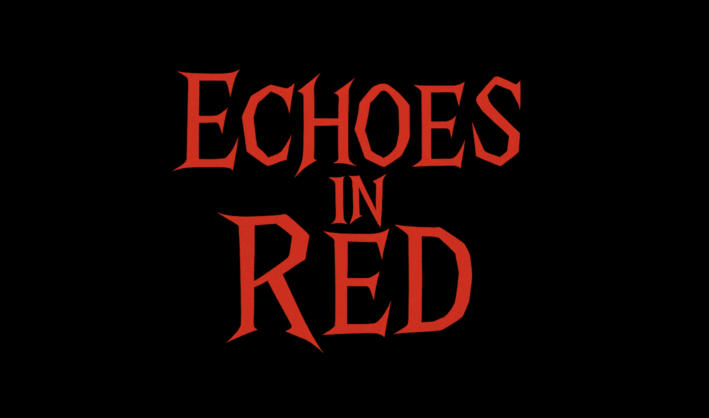
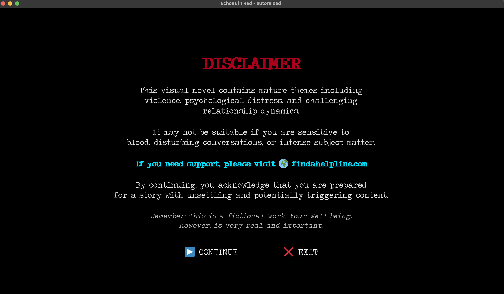
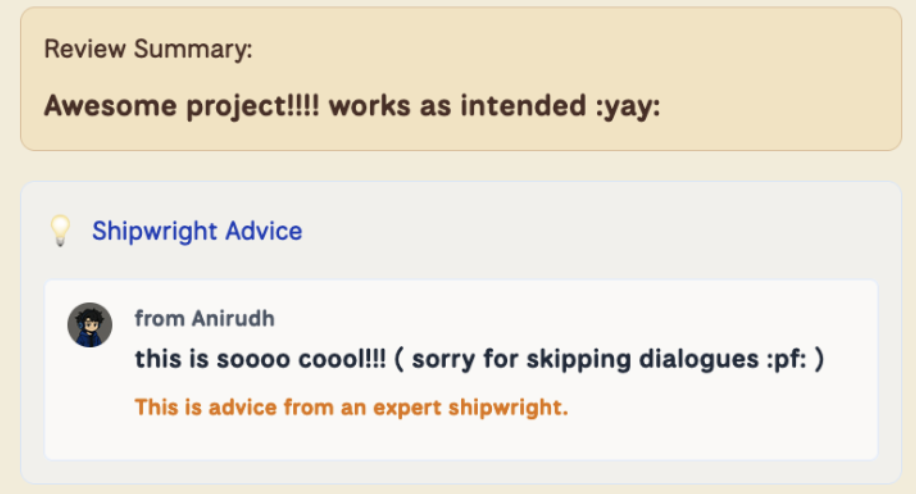

_How I survived Summer of Making while also preparing for university (and procrastinating more than I would like to admit)_

## The "Why Not?" That Changed Everything

This summer, I joined Summer of Making by Hack Club and GitHub. The deal: build stuff, ship it, earn shells (literal currency) and  buy cool things. I am not ashamed the shells got me lol.

My reasoning for signing up? "Why not?" That's it. No plan just  curiosity. This was my first time doing anything like this and honestly, Best impulsive decision ever.

**Plot twist**: this wasn't exactly a free summer. I was stuck in that stressful period between high school and university you know, where you're simultaneously excited and terrified while drowning in paperwork. University prep, existential dread, the usual. So I knew going in I wouldn't have tons of time for this.

**Here's the honest truth though**: it wasn't just university prep eating my time. Let's be real: I procrastinated. A lot. Like, a concerning amount. You know those days where you tell yourself "I will be productive today" and then somehow it is 6 PM and you have accomplished nothing except watching series and shows. Yeah, those happened. Frequently.

The program ran from mid June to September (extended because everyone got addicted) and despite not being nearly as productive as I could have been, I actually made things. 

## The Projects: Five Things I Actually Shipped (I am Shocked Too)

Plot twist: I built five projects. FIVE. Which sounds impressive until you remember I spent half the summer binge watching series. But they exist, they work (mostly), so let's go.

 ### Project 1: Rock Paper Scissors – The Oops

Started with a Rock Paper Scissors game. HTML, CSS, JavaScript. Emoji choices because I have taste. Best of three against the computer. Simple stuff.

The catch? I didn't realize we had to build things during the program, not submit pre made stuff.  But hey, at least the emojis were adorable, and we learn from our mistakes (supposedly).

[`Try the demo (spoiler: you'll lose) →`](https://golden-fox07.github.io/Rock-Paper-Scissors/)

---

### Project #2: Anime Quote Generator – "How Did This Work?"

Built an anime quote generator in React. Keyword: rookie React skills. I genuinely don't know how I made this work. Looking back at the code is like reading hieroglyphics written by my past self.

But it works! Your favorite anime quotes, delivered with maximum chaos. Just like my development process. Chef's kiss.

[`Get your daily dose of anime wisdom here →`](https://golden-fox07.github.io/quote-generator/)

---

### Project #3: Pong War – lowkey proud of it

Decided to build Pong in Godot 4. But make it harder for no reason. Zero external assets. No sprites, no sounds, no fonts. Just raw code.

<video 
  controls 
  src="images/pong-war-demo.mp4"
  title="Pong War Demo" 
  style="width:100%; max-width:800px; border-radius:8px; display:block; margin:1rem auto;">
</video> 

Why? Probably avoiding university paperwork. But it was weirdly fun making things difficult for myself. Pure code, pure Pong.

[`Play if you're into retro vibes →`](https://golden-fox07.itch.io/pong-war)

---

### Project #4: ToDo List – The TypeScript Flex

Yes, a to-do list. Yes, in 2024. BUT ...first TypeScript project, Jumping from JavaScript to TypeScript felt like a genuine achievement, even if the project is basic.

Best part: "Proving I can actually finish tasks at least in code." The irony of building a productivity app while procrastinating everything else? Immaculate.

[`Organize your life here (ironic, I know) →`](https://to-do-golden-fox07.vercel.app/)

---

### Project #5: Echoes in Red – The One That Actually Matters

Okay, this one. THIS ONE. My pride and joy. A looping visual novel in Renpy where you wake up, make choices, regret everything, and loop back. 

My pitch: "At least it's cheaper than therapy."

This took FOREVER. Mapping the story loops, all the choice branches, making it actually work  exhausting. But also the most fun I had all summer. When I actually care about something, even my procrastination brain shuts up (temporarily).

<!-- |  |  |
|---------------|---------------|
|  |  -->

  
  
  

Got multiple compliments on Slack for this. Literally made my entire summer. Nothing beats shipping something you actually love and having people say "hey, this is cool." 10/10, would emotionally damage players again.

[`Play at your own risk (therapy not included) →`](https://golden-fox07.itch.io/echoes-in-red)

So yeah. Five projects. From "wait, I did this wrong" to "I'm genuinely proud of this." Not bad for someone who spent significant time doing absolutely nothing productive.

---

## **The Community: Wish I had Been More Active**

The Hack Club Slack was genuinely cool from what I saw. People building wild stuff, helping each other, sharing wins. Good vibes all around.

Real talk though: I wasn't very active. Between university prep and, let's be honest, my Olympic level procrastination skills, I mostly lurked. I would check in occasionally, see the interesting conversations happening, think "I should participate more," and then... not do that. Classic move.

I did catch some helpful advice when I did pop in, and the few interactions I had were great. The community seemed genuinely supportive and fun. Do I wish I had been more involved? Absolutely. Did my brain cooperate with that wish? Not really. That's the authentic experience right there.

---
## **Final Thoughts: You Don't Have To Be Perfect To Ship**

Summer of Making taught me that you don't need to be consistently productive or perfectly disciplined to make things. You just need to actually do it, even if it's messy and inconsistent. I procrastinated a lot. I wasn't as active in the community as I could have been. I probably wasted half my summer doing nothing.

But I still end up shipping multiple projects. They are real, they work, and I made them. That's more than I would have done if I'd waited to "be more productive first."

If you are someone who struggles with consistency or procrastination (yep, I feel you), don't let that stop you from joining things like this. You will probably still procrastinate. But you might also actually finish something for once. Worth it.

---

**And just like that, here’s my own Summer of Making Wrap... the projects, the progress, the procrastination and the wins ✨**

<video 
  controls 
  src="images/wrap.mp4"
  title="wrap" 
  style="width:100%; max-width:800px; border-radius:8px; display:block; margin:1rem auto;">
</video> 

---

_Stop waiting to be perfectly productive. You won't be. Build something anyway_

